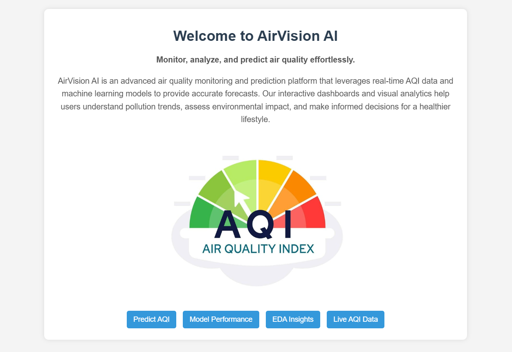

# AirVision AI

![AirVision AI] 
*A machine learning-powered air quality prediction system with real-time AQI monitoring.*

## 📌 Overview
AirVision AI is an advanced air quality prediction system that leverages machine learning models to forecast AQI (Air Quality Index). The project includes:
- Real-time AQI data integration
- Predictive modeling using multiple algorithms
- A Flask-based web application with an interactive UI (Work in Progress)

## 📂 Dataset
The dataset was extracted via web scraping from [Tutiempo.net](http://en.tutiempo.net/climate) using BeautifulSoup. It includes historical climate data essential for training models.

## 🚀 Features
- **Real-time AQI Monitoring:** Fetches live air quality data using APIs.
- **Multi-Model Implementation:** Linear Regression, Decision Tree, Lasso, Ridge, Elastic Net, Random Forest, XGBoost, and KNN.
- **Hyperparameter Tuning & Feature Engineering:** Optimized models for accurate predictions.
- **Flask Web Application:** A four-page UI for user interaction (Work in Progress).
- **User Input-Based AQI Prediction:** Uses a trained Random Forest model to calculate AQI based on user input.

## 🏗️ Tech Stack
- **Programming Language:** Python
- **Machine Learning:** Scikit-Learn, XGBoost
- **Web Framework:** Flask
- **Data Processing:** Pandas, NumPy
- **Visualization:** Matplotlib, Seaborn
- **Deployment (Future):** Docker, AWS/GCP


## 📷 UI



### Prediction Demo


## 🔧 Installation & Usage
```bash
# Clone the repository
git clone https://github.com/Janvi-184/AirVision-AI.git
cd AirVision-AI

# Create a virtual environment and activate it
python -m venv venv
source venv/bin/activate  # On Windows: venv\Scripts\activate

# Install dependencies
pip install -r requirements.txt

# Run the Flask app
python app.py
```

## 📌 Future Improvements
- Improve UI design
- Deploy the Flask application
- Enhance model performance with additional data

## 📜 License
This project is licensed under the MIT License.

---
*Developed with ❤️ by Janvi-184*
